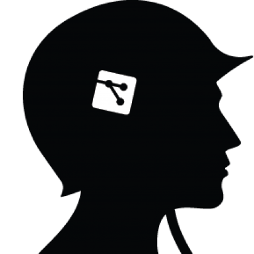

Gitwar*
======

A platform for git-based turn-based command-line games.

Gitwar and each of its games are written in BASH. That's right.
Git, shell scripting, and playing games has never been so... weird.

## Games

1. [Gitfight](http://github.gitwar/gitfight)
2. [Gitchess](http://github.gitwar/gitchess)
3. [Gitcastle](http://github.gitwar/gitcastle)

## How to play

1. Fork the repo of one of the Gitwar games
2. Add a friend as a collaborator
3. Run the executable: `./gitwar`
4. Submit your first turn, and wait for your friend to submit theirs.

## Note

This is more for fun than for anything else. It's just yet another way
of showing how cool git and Github are.

Have fun!

------
http://tybenz.com

*[Gitwar logo](http://thenounproject.com/noun/soldier/#icon-No1697) designed
by [Simon Child](http://thenounproject.com/Simon Child) from the [Noun
Project](http://thenounproject.com) and [Jason
Long](http://twitter.com/jasonlong) from
[git-scm.com](http://git-scm.com/downloads/logos).
